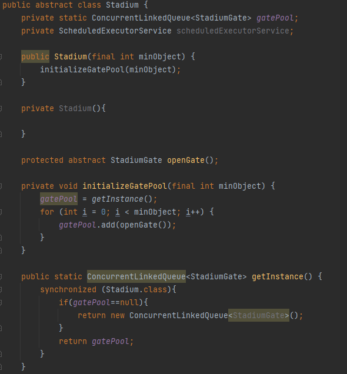
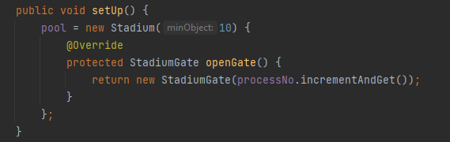
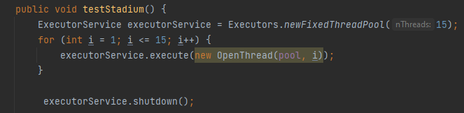
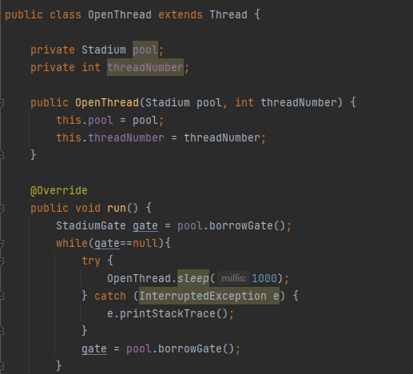
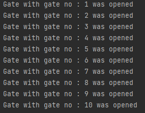
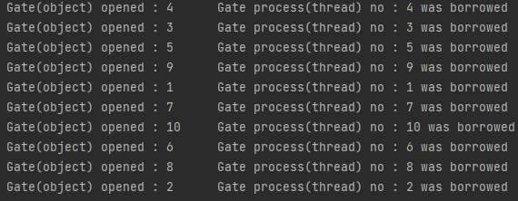
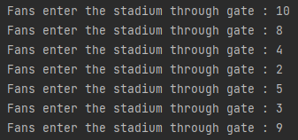
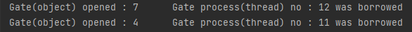

Object Pool ve Singleton ile Multi-Thread Projesi

Yazılım dünyasında nesneler sınıflardan örnek alındığı sırada
'örnek alınma zamanı' denilebilecek bir süre kaybeder.
Object pool tasarım deseni bu problemi ortadan kaldırmaya yönelik çalışan
bir tasarım desenidir.

Probleme örnek vermek gerekirse , üniversite sınavına giren
ve sonuç bekleyen 2 milyon öğrenci olduğunu varsayalım.
Üniversite sonucu açıklanacağı esnada 2 milyon öğrencinin aynı anda
sonuçların yayınlandığı internet sitesine giriş yapmaya çalıştığını ele alalım.
Bu durumda giriş yapmaya çalışan öğrencilerden çok büyük bir kısmı başarılı giriş yapamayacak ve
giriş yapması belki de saatler sürecek.

Bu problemin çözümü olarak sistemin açılmasından saatler öncesinde çalışan bir login servisimiz olduğunu ,
bu servis çalıştığı her an object pool'a yeni bir login kaydettiğini (thread sayısı sınırlandırılabilir) ve
login servisimize istek geldiği anda pool'dan isteği daha hızlı yanıtlamak üzere nesne kullanabilir.

Ben ise bu projede "Stadyum" problemini örneklemeye çalıştım. Bu problemi somutlaştırmak gerekirse ,
Futbol maçı öncesinde stadyuma giriş yapmaya çalışan 50.000 taraftar olduğunu varsayalım. Stadyum kapılarının (10 adet)
ise belli bir zaman aralığında 1000 taraftar kabul edebileceğini ve sadece 1 kapı açıldığını düşünelim.

Belki de maç saatinden 5-6 saat önce stadyumda sıraya girmemiz gerekirdi. Eğer maç saatinden önce
stadyuma ait 10 kapı açılmış olsaydı taraftarlar stadyuma daha fazla beklemek gerekmeden girebilirdi.

Başlangıç olarak problemimizde stadyum 1 tane olmak zorunda olduğu için Singleton Pattern kullanılmıştır.

Yazmış olduğum "StadiumDemo" classında stadyum kapılarının 10 adet olduğu(pool içerisinde
minimum 10 adet kapı) belirtilmiştir. (Stadyuma maç sırasında yeni kapı açılmasının mümkün olduğunu varsayalım)

Buna rağmen işlem yapacak thread sayımızın (kapı sayısının) ise 15 olduğunu varsayalım.

Açılan her kapıdan taraftarlar girmeye devam edebilir. Ta ki kapılardaki yoğunluk azalana kadar. Yoğunluk azaldıktan
sonra ise kapılar (threadler) tekrar yoğunluk olana kadar sırayla kapanmaktadır. Tekrar yoğunluk olur ise sırada bekleyen
threadler yeni kapıları açmakla görevlidir.

Son olarak kodu çalıştırdığımız zaman ise çıktılarımıza bakıp senaryomuzu tamamlayalım.

-> İlk olarak stadyumdaki kapılar açıldı.

-> Stadyum kapıları kullanılabilir duruma getirildi.

-> Taraftarlar kapılardan girişe başladı.

-> Sırası biten kapılar kapatılmaya başlandı.

image::../public/images/gate_closed.png[]

-> Kapatılan kapılar yoğunluk oluştukça açıldı.

|| ismail coşkun 180201160

